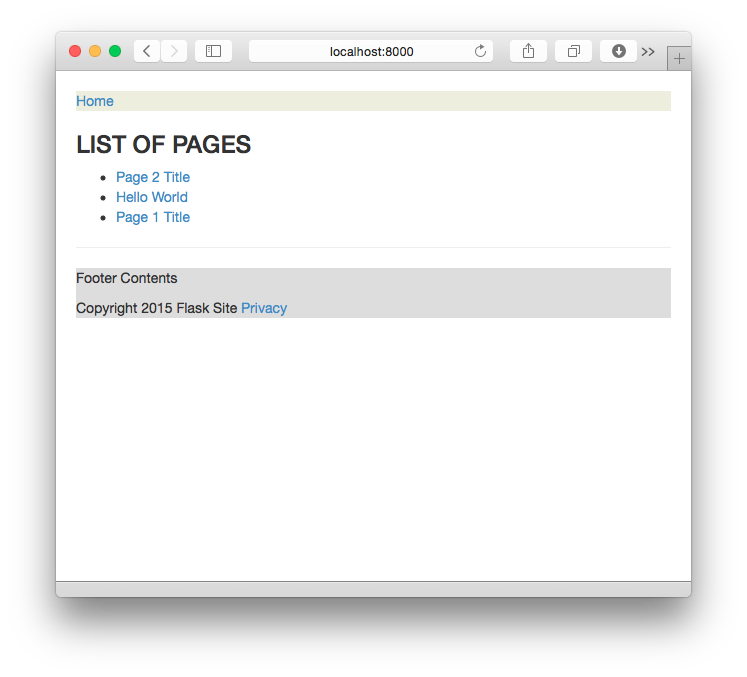
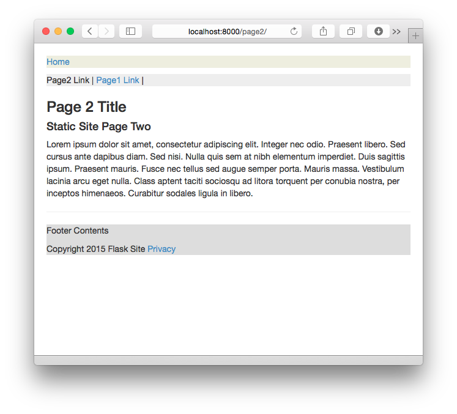

# Static-Flask
Static website generator using Flask, Frozen-Flask and more.


#### Projec Folder Structure

```
.
├── LICENSE
├── README.md
├── pages
│   ├── hello-world.md
│   ├── page1.md
│   └── page2.md
├── sitebuilder.py
├── static
│   ├── css
│   │   ├── bootstrap.min.css
│   │   └── site.css
│   └── images
│       └── boston.jpg
└── templates
    ├── base.html
    ├── index.html
    └── page.html

```

#### Generating the Site
Once virtualenv is activated with all the packages available in the *requirements* file, then run the following to build the site.

    $ python sitebuilder.py build


#### Static Site Structure
```
(flaskenv)AK-Mac:Static-Flask ak$ tree build/
build/
├── hello-world
│   └── index.html
├── index.html
├── page1
│   └── index.html
├── page2
│   └── index.html
└── static
    ├── css
    │   ├── bootstrap.min.css
    │   └── site.css
    └── images
        └── boston.jpg

6 directories, 7 files

```

**Run the HTTP server on localhost to see the site**

    (flaskenv)AK-Mac:Static-Flask ak$ python -m SimpleHTTPServer 8000

## Screenshots of the Site




